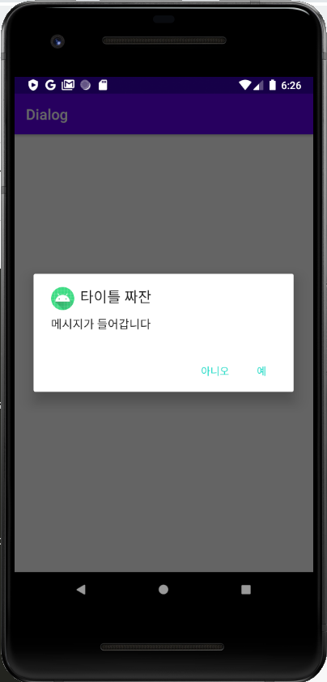

# AlertBuilder.Dialog


### setup
```JAVA
AlertDialog.Builder builder = new AlertDialog.Builder(this);
```

### Image
```JAVA
builder.setIcon(R.mipmap.ic_launcher);
```

### Title, Message
```JAVA
builder.setTitle("타이틀 짜잔");
builder.setMessage("메시지가 들어갑니다");
```

### Yes, No
```JAVA
// UI 가 변경 되어서, 예는 오른쪽, 아니오는 왼쪽에 위치 한다.
builder.setPositiveButton("예", new DialogInterface.OnClickListener() {
    @Override
    public void onClick(DialogInterface dialog, int which) {
        ...
    }
});

builder.setNegativeButton("아니오", new DialogInterface.OnClickListener() {
    @Override
    public void onClick(DialogInterface dialog, int which) {

    }
});
```

### show
```JAVA
builder.create().show();
```

|type|description|
|-|-|
|```builder.setCancelable(false);```|if you want answer for sure, we use this. <br> if this is true, by clicking background (gray area) will unshow the alert builder|


## All together
```JAVA
    @Override
    public void onClick(View v) {
        AlertDialog.Builder builder = new AlertDialog.Builder(this);
        builder.setIcon(R.mipmap.ic_launcher);
        builder.setTitle("타이틀 짜잔");
        builder.setMessage("메시지가 들어갑니다");
        builder.setPositiveButton("예", new DialogInterface.OnClickListener() {
            @Override
            public void onClick(DialogInterface dialog, int which) {

            }
        });

        builder.setNegativeButton("아니오", new DialogInterface.OnClickListener() {
            @Override
            public void onClick(DialogInterface dialog, int which) {

            }
        });
        builder.create().show();
    }
```
