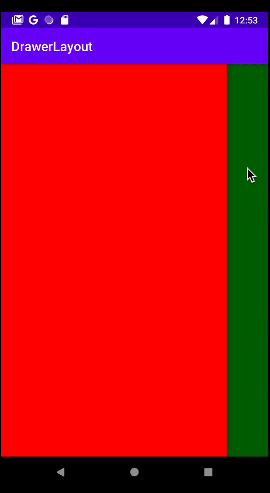

# Drawer Layout
Sometimes, there is a menu button and the menu bar slides on to the view. That is called Drawer Layout.



--- 

### XML
**```androidx.drawerlayout.widget.DrawerLayout```** is the way to set up.

```xml
<?xml version="1.0" encoding="utf-8"?>
<androidx.drawerlayout.widget.DrawerLayout xmlns:android="http://schemas.android.com/apk/res/android"
    xmlns:app="http://schemas.android.com/apk/res-auto"
    xmlns:tools="http://schemas.android.com/tools"
    android:id="@+id/drawer"
    android:layout_width="match_parent"
    android:layout_height="match_parent"
    tools:context=".MainActivity">

    <!-- menu popup view -->
    <LinearLayout
        android:layout_width="match_parent"
        android:layout_height="match_parent"
        android:layout_gravity="start"
        android:background="#ff0000">
    </LinearLayout>

    <!-- main view -->
    <RelativeLayout
        android:layout_width="match_parent"
        android:layout_height="match_parent"
        android:background="#00ff00">

        <ImageButton
            android:id="@+id/btn"
            android:layout_width="wrap_content"
            android:layout_height="wrap_content"
            android:src="@drawable/ic_baseline_menu_24"
            android:background="#00ff00"
            android:layout_margin="12dp"/>

    </RelativeLayout>


</androidx.drawerlayout.widget.DrawerLayout>
```

### JAVA
```JAVA
public class MainActivity extends AppCompatActivity {
    
    // call drawer
    DrawerLayout drawer;

    @Override
    protected void onCreate(Bundle savedInstanceState) {
        super.onCreate(savedInstanceState);
        setContentView(R.layout.activity_main);
        // setup drawer
        drawer = findViewById(R.id.drawer);

        // open menu by pressing the hamburger button
        findViewById(R.id.btn).setOnClickListener(new View.OnClickListener() {
            @Override
            public void onClick(View v) {
                drawer.openDrawer(GravityCompat.START);
            }
        });
    }
}
```

|type|description|
|-|-|
|```drawer.openDrawer(GravityCompat.START);```|This slides in the drawer layout|
|```drawer.setDrawerLockMode(DrawerLayout.LOCK_MODE_LOCKED_CLOSED);```|This will disable availability of the slide gesture.|
|```drawer.isDrawerOpen(GravityCompat.START)```|boolean to figure whether it is opened or not|
|