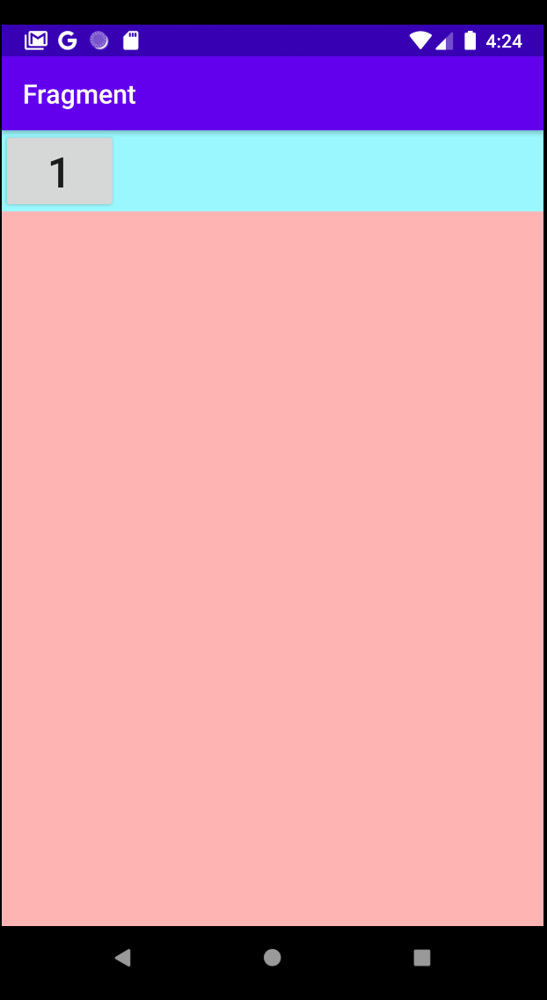

# Fragment
핸드폰에는 드물수도있지만, 태블렛 같은경우 액티비티로 왔다 갔다 하는 것을 방지하기 위해 한 화면(Activity)에 두개 이상의 Fragment를 작성 할 수 있다. 
핸드폰같은 경우는 Activity안에 프레그먼트를 교체한다라고 생각하면 편하다


|Pros|Cons|
|-|-|
|Structure (설계)|error occurs due to lifecycle

### Lifecycle


---

## setup
1. 프레그먼트를 위한 xml 레이아웃을 만든다.
2. 프레그먼트 클래스를 만든다
3. 액티비티에서 프래그먼트를 초기화 해준다
4. 필요에 따라 불러서 화면을 구성한다.

### xml
```xml
<?xml version="1.0" encoding="utf-8"?>
<RelativeLayout xmlns:android="http://schemas.android.com/apk/res/android"
    xmlns:app="http://schemas.android.com/apk/res-auto"
    xmlns:tools="http://schemas.android.com/tools"
    android:background="#9AF7FD"
    android:layout_width="match_parent"
    android:layout_height="match_parent"
    tools:context=".MainActivity">


    <Button
        android:id="@+id/btn1"
        android:layout_width="wrap_content"
        android:layout_height="wrap_content"
        android:text="1"
        android:textSize="32sp"/>

    <RelativeLayout
        android:id="@+id/body_rl"
        android:layout_width="match_parent"
        android:layout_height="match_parent"
        android:layout_below="@+id/btn1">
    </RelativeLayout>

</RelativeLayout>
```
In ```RelativeLayout``` with ```android:id="@+id/body_rl"```, that is where Fragment view will show.<br>
Also, need to create separate fragment layouts. 
```xml
<?xml version="1.0" encoding="utf-8"?>
<RelativeLayout xmlns:android="http://schemas.android.com/apk/res/android"
    android:layout_width="match_parent"
    android:layout_height="match_parent"
    android:background="#FFB4B4">
</RelativeLayout>

```

### JAVA
```Java
// separate fragments
import android.os.Bundle;
import android.view.LayoutInflater;
import android.view.View;
import android.view.ViewGroup;
import androidx.annotation.Nullable;
import androidx.fragment.app.Fragment;

public class Fragment1 extends Fragment {
    public Fragment1() {

    }

    @Nullable
    @Override
    public View onCreateView(LayoutInflater inflater, @Nullable ViewGroup container, Bundle savedInstanceState) {
        View layout = inflater.inflate(R.layout.layout_frag1, container, false);

        return layout;
    }
}
```
Do not know the reason, but make sure that 
```Java
import androidx.fragment.app.Fragment;
```
is in the Java Fragment class.


```Java
// main
public class MainActivity extends AppCompatActivity {

    Fragment1 frag1 = new Fragment1();

    @Override
    protected void onCreate(Bundle savedInstanceState) {
        super.onCreate(savedInstanceState);
        setContentView(R.layout.activity_main);

        FragmentManager fm = getSupportFragmentManager();
        FragmentTransaction ft = fm.beginTransaction();

        // R.id.body_rl is in activity_main.xml. This is where fragment view shows up.
        ft.replace(R.id.body_rl, frag1);        
        ft.commit();
    }
}
```

### output
