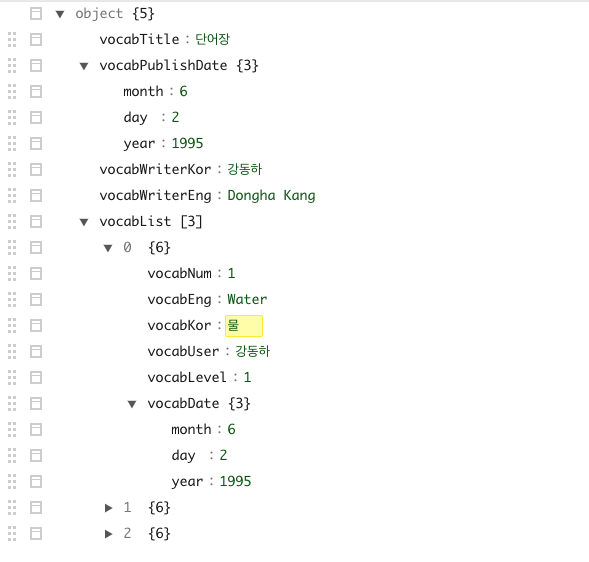

# JSON
**JSON**(JavaScript Object Notation) is used as object.
JSONObject can put *int, String, array and Object*. 
It is used similiar to Dictionary

#### Object
```JAVA
// JSONObject
String profile = "{name : 강동하, age : 1995, address : 서울시 광진구 }";

try {
    JSONObject obj = new JSONObject(profile);
    Log.d("NAME PRINT", "Name: " + obj.getString("name"));
    Log.d("AGE  PRINT", "Age : " + obj.getString("age"));
    Log.d("ADDR PRINT", "Addr: " + obj.getString("address"));
} catch (JSONException e) {
    e.printStackTrace();
}
```

#### Array
``` JAVA
// JSONArray
String arr1 = "[가, 나, 다, 라]";
String arr2 = "[ {name : 강동하, age : 1995, address : 서울시 광진구 }" +
        "{name : 강동하, age : 1995, address : 서울시 광진구 }" +
        "{name : 강동하, age : 1995, address : 서울시 광진구 } ]";
String arr3 = "[ [가, 나, 다], [라, 마, 바], [사, 아, 자] ]";

try {
    JSONArray jrr1 = new JSONArray(arr1);
    for (int i = 0; i < jrr1.length(); i ++) {
        Log.d("PRINT JRR1", "jrr1: " + jrr1.getString(i));
    }
 
    JSONArray jrr2 = new JSONArray(arr2);
    for (int j = 0; j < jrr2.length(); j ++) {
        JSONObject temp = jrr2.getJSONObject(j);
        Log.d("PRINT JRR2", "jrr2: " + temp.getString("name"));
    }

    JSONArray jrr3 = new JSONArray(arr3);
    for (int j = 0; j < jrr3.length(); j ++) {
        JSONArray temp2 = jrr3.getJSONArray(j);
        Log.d("PRINT JRR2", "jrr2: " + temp2.getString(0));     // 맨 첫번째 원소만 아웃
    }
} catch (JSONException e) {
    e.printStackTrace();
}
```

|type|description|
|-|-|
|```JSON.put("key", value)```|put value to "key" in JSONObject or JSONArray|
|```JSON.toString()```|change the data to string|

click [here](https://www.json.org/json-en.html) for more info

#### Examples
``` JAVA
{
  "vocabTitle":"단어장",
  "vocabPublishDate": {"month":"6", "day":"2", "year":"1995"},
  "vocabWriterKor": "강동하",
  "vocabWriterEng": "Dongha Kang",
  "vocabList":
  [ {
      "vocabNum":"1",
      "vocabEng": "Water",
      "vocabKor": "물",
      "vocabUser": "강동하",
      "vocabLevel": "1",
      "vocabDate": {
        "month": "6",
        "day": "2",
        "year": "1995"
      }
     },
    {"vocabNum":"2",
    "vocabEng": "Fire",
    "vocabKor": "불",
    "vocabUser": "강동하",
    "vocabLevel": "1",
    "vocabDate": {
      "month": "6",
      "day": "2",
      "year": "1995"
      }
    },
    {"vocabNum":"3",
    "vocabEng": "Apologize",
    "vocabKor": "사과하다",
    "vocabUser": "강동하",
    "vocabLevel": "4",
    "vocabDate": {
      "month": "6",
      "day": "2",
      "year": "1995"
    }
  } ]
}
```


** use [online editor](https://jsoneditoronline.org/#left=local.mafigi&right=local.mokemi) for visualization will make everything simple!

