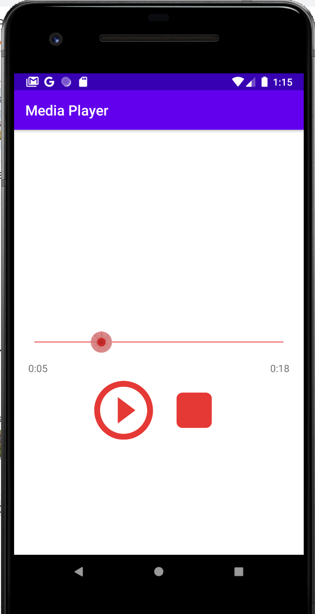

# Media Player

## Setup
1. MediaPlayer 객체 생성
```JAVA
mediaPlyaer = new MediaPlayer();
try {
    mediaPlayer.setDataSource(url);
    mediaPlayer.prepare(); 
} catch (IOException e) {
    e.printStackTrace();
}

```

## Features
|Syntax | Description|
|-------| -----------|
|```mp.getDuration();```| total play time (총 재생 시간) in ms|
| ```mp.seekTo(1000);``` | move to 1 sec (현재 재생부분 가져옴) in ms|
|```mp.pause();``` | Pause (일시정지)|
|```mp.resume();```| resume (재개)|
|```mp.stopPlayback();``` | Disable video for good (완전 스탑)|
|```mp.isPlaying()```| Boolean return to find if it is playing (재생 여부)|
|```mp.start();```| start (시작)|
|```mp.getCurrentPosition();```| current position, 현재 위치|
|```mp.release();``` <br> ```mp = null```| when onDestroy(), release and delete the data. 앱을 끌때,|


## Result


