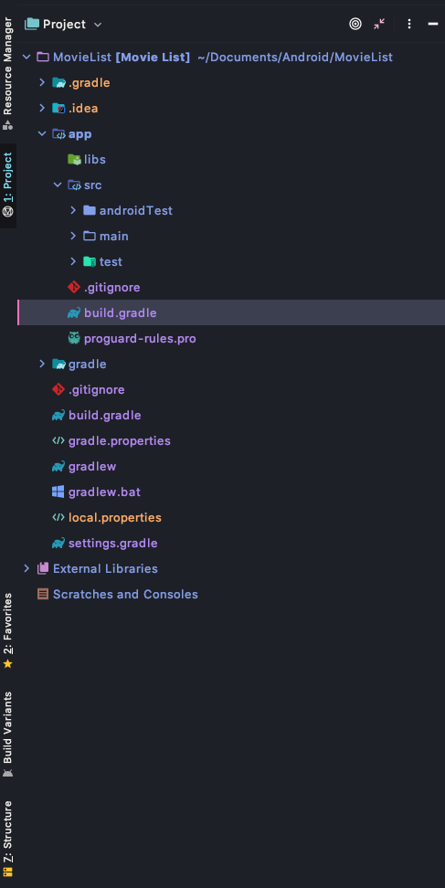

# Import JSON with API and Http
This introduction will show how to obtain data from real life API sources.
There are numerous amount of different libraries for http network connection. Will use Volley in particular.

## Volley Setup

1. Go to ./app/build.gradle
2. add below in dependencies.
   ```JAVA
    dependencies {
        ...
        implementation 'com.android.volley:volley:1.1.1'
    }

   ```
3. Sync by pressing this button


4. Give permission in **AndroidManifest.xml** (outside the application)
    ```XML
    <uses-permission android:name="android.permission.INTERNET"/>  
    ```

For more info, press [here](https://velog.io/@dlrmwl15/%EC%95%88%EB%93%9C%EB%A1%9C%EC%9D%B4%EB%93%9C-Volley%EB%A5%BC-%EC%9D%B4%EC%9A%A9%ED%95%9C-HTTP-%ED%86%B5%EC%8B%A0)

<br><br>

## Usage
Assume we have TextView, Button.
Also, we assume we send internet request when the button is pressed. That request is the ```request()``` function.

```JAVA
private void request() {
    String url = "http://www.kobis.or.kr/kobisopenapi/webservice/rest/boxoffice/searchDailyBoxOfficeList.json?key=22d5c15941cb3125ca046e747b13551c&targetDt=20190602";

    RequestQueue requestQueue = Volley.newRequestQueue(this);
    StringRequest myReq = new StringRequest(Request.Method.GET, url, successListener, errorListener);

    requestQueue.add(myReq);
}
```

```JAVA
Response.Listener<String> successListener = new Response.Listener<String>() {
    @Override
    public void onResponse(String response) {
        // 통신을 성공 할 시
    }
};

Response.ErrorListener errorListener = new Response.ErrorListener() {
    @Override
    public void onErrorResponse(VolleyError error) {
        // 통신을 실패할 시
    }
};
```