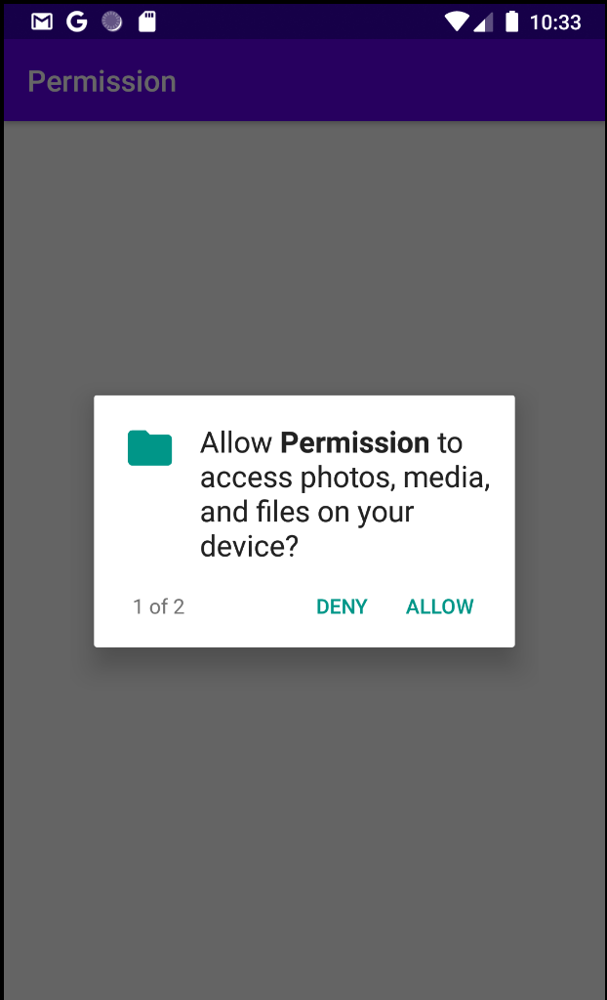

# Permission
permission asks



## AndroidManifest.xml
```XML
<?xml version="1.0" encoding="utf-8"?>
<manifest xmlns:android="http://schemas.android.com/apk/res/android"
    package="com.example.permission">

<!--    내장 하드에 저장을 할 수 있는지 없는지 권한을 부여-->
    <uses-permission android:name="android.permission.WRITE_EXTERNAL_STORAGE"/>
    <uses-permission android:name="android.permission.READ_EXTERNAL_STORAGE"/>
<!--    GPS 설정 권한 -->
    <uses-permission android:name="android.permission.ACCESS_COARSE_LOCATION"/>
    <uses-permission android:name="android.permission.ACCESS_FINE_LOCATION"/>
<!--    INTERNET 설정 권한 -->
    <uses-permission android:name="android.permission.INTERNET"/>

    <application
        android:allowBackup="true"
        android:icon="@mipmap/ic_launcher"
        android:label="@string/app_name"
        android:roundIcon="@mipmap/ic_launcher_round"
        android:supportsRtl="true"
        android:theme="@style/AppTheme">
        <activity android:name=".MainActivity">
            <intent-filter>
                <action android:name="android.intent.action.MAIN" />

                <category android:name="android.intent.category.LAUNCHER" />
            </intent-filter>
        </activity>
    </application>

</manifest>
```

## MainActivity.java
```Java
public class MainActivity extends AppCompatActivity {

    @Override
    protected void onCreate(Bundle savedInstanceState) {
        super.onCreate(savedInstanceState);
        setContentView(R.layout.activity_main);

        int chk = ContextCompat.checkSelfPermission(this, Manifest.permission.WRITE_EXTERNAL_STORAGE);
        if (chk == PackageManager.PERMISSION_DENIED) {
            // 익스터널 스토리지에 저장을 받았는가 안받았는가 물어봄
            String[] arr = {Manifest.permission.WRITE_EXTERNAL_STORAGE, Manifest.permission.READ_EXTERNAL_STORAGE,
                            Manifest.permission.ACCESS_FINE_LOCATION, Manifest.permission.ACCESS_COARSE_LOCATION};
            // GPS
            // { Manifest.permission.ACCESS_COARSE_LOCATION, Manifest.permission.ACCESS_FINE_LOCATION}
            ActivityCompat.requestPermissions(this, arr, 3000);
        }
//        else if (chk == PackageManager.PERMISSION_GRANTED) {
//
//        }
    }

    @Override
    public void onRequestPermissionsResult(int requestCode, @NonNull String[] permissions, @NonNull int[] grantResults) {
        super.onRequestPermissionsResult(requestCode, permissions, grantResults);
        Log.d("PERMISSION", "PERMISSION");

    }
}
```

```Java
public class MainActivity extends AppCompatActivity {

    @Override
    protected void onCreate(Bundle savedInstanceState) {
        super.onCreate(savedInstanceState);
        setContentView(R.layout.activity_main);

        int chk = ContextCompat.checkSelfPermission(this, Manifest.permission.WRITE_EXTERNAL_STORAGE);
        if (chk == PackageManager.PERMISSION_DENIED) {
            // 익스터널 스토리지에 저장을 받았는가 안받았는가 물어봄
            String[] arr = {Manifest.permission.WRITE_EXTERNAL_STORAGE, Manifest.permission.READ_EXTERNAL_STORAGE,
                            Manifest.permission.ACCESS_FINE_LOCATION, Manifest.permission.ACCESS_COARSE_LOCATION};
            ActivityCompat.requestPermissions(this, arr, 3000);
        }
    }

    @Override
    public void onRequestPermissionsResult(int requestCode, @NonNull String[] permissions, @NonNull int[] grantResults) {
        super.onRequestPermissionsResult(requestCode, permissions, grantResults);
        Log.d("PERMISSION", "PERMISSION");
    }
}
```

|type|description|
|-|-|
|```if (chk == PackageManager.PERMISSION_GRANTED)``` <br>```if (chk == PackageManager.PERMISSION_DENIED)```|Whether or not the permission is granted or not|
|```requestPermissions```|method pop up|
|```onRequestPermissionsResult```|link with **requestpermissions**, check the result of requestPermissions|
|```boolean isDenied = ActivityCompat.shouldShowRequestPermissionRationale(this, Manifest.permission.WRITE_EXTERNAL_STORAGE);```|Did you ever denied this permission ?|


<br><br><br>
[**Link to more permission**](https://s262701-id.tistory.com/96)