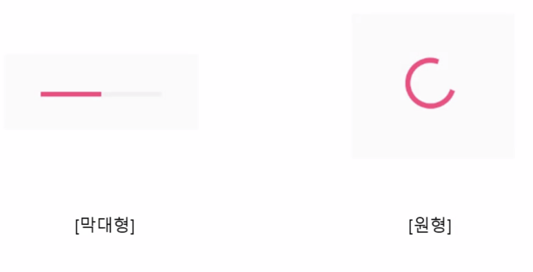
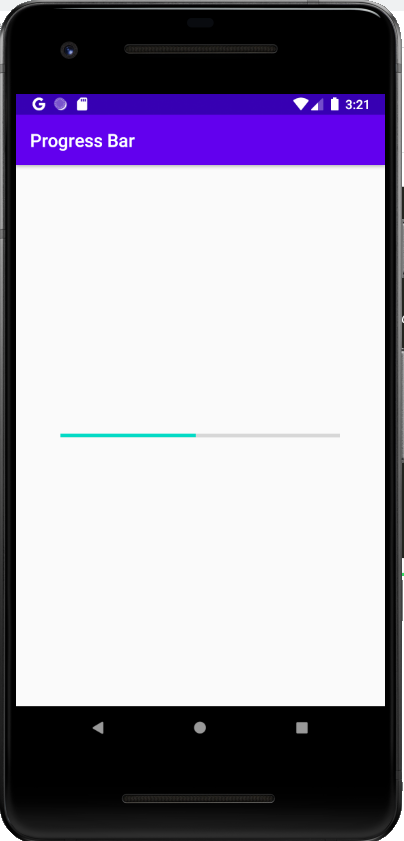
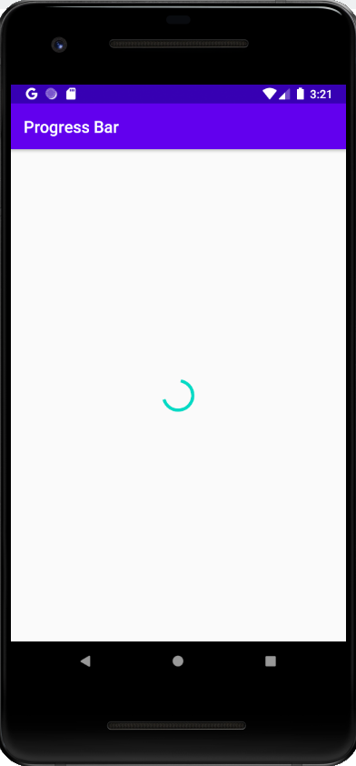

# Progress Bar
progress bar is used for loading symbols



#### circular
- default progress bar
- ```style="?android:attr/progressBarStyle"```
- use ```setVisibility("View.VISIBLE")``` will make progress bar rotate constantly

#### horizontal
- ```style="?android:attr/progressBarStyleHorizontal"```
- ```:max = 100``` setting maximum to 100
- ```:progress = 50``` setting progress to 50, half way.

---

### XML
```XML
<?xml version="1.0" encoding="utf-8"?>
<RelativeLayout xmlns:android="http://schemas.android.com/apk/res/android"
    xmlns:app="http://schemas.android.com/apk/res-auto"
    xmlns:tools="http://schemas.android.com/tools"
    android:layout_width="match_parent"
    android:layout_height="match_parent"
    tools:context=".MainActivity">

    <Button
        android:id="@+id/btn_download"
        android:layout_width="wrap_content"
        android:layout_height="wrap_content"
        android:layout_below="@+id/progress_download"
        android:layout_centerInParent="true"
        android:layout_margin="24dp"
        android:text="download"/>

    <Button
        android:id="@+id/btn_loading"
        android:layout_width="wrap_content"
        android:layout_height="wrap_content"
        android:text="loading"
        android:layout_below="@+id/btn_download"
        android:layout_centerHorizontal="true"/>


    <ProgressBar
        android:id="@+id/progress_loading"
        style="?android:attr/progressBarStyle"
        android:layout_width="wrap_content"
        android:layout_height="wrap_content"
        android:layout_centerInParent="true"
        android:visibility="invisible"/>
    
    <ProgressBar
        android:id="@+id/progress_download"
        android:layout_width="match_parent"
        android:layout_height="wrap_content"
        android:layout_margin="50dp"
        android:max="100"
        android:visibility="invisible"
        android:layout_centerInParent="true"
        style="?android:attr/progressBarStyleHorizontal"/>

</RelativeLayout>
```

### JAVA
```JAVA
package com.example.progressbar;

import *;

public class MainActivity extends AppCompatActivity implements View.OnClickListener {

    ProgressBar progressLoading;
    ProgressBar progressDownload;
    Button btnDownload;
    Button btnLoading;

    int t = 0;
    boolean isDownload = false;

    @Override
    protected void onCreate(Bundle savedInstanceState) {
        super.onCreate(savedInstanceState);
        setContentView(R.layout.activity_main);

        btnDownload = findViewById(R.id.btn_download);
        btnLoading  = findViewById(R.id.btn_loading);

        progressDownload = findViewById(R.id.progress_download);
        progressLoading  = findViewById(R.id.progress_loading);

        btnDownload.setOnClickListener(this);
        btnLoading.setOnClickListener(this);

        progressDownload.setMax(500);
    }

    @Override
    protected void onDestroy() {
        super.onDestroy();
        handler.removeMessages(0);
    }

    @Override
    public void onClick(View v) {
        switch (v.getId()) {
            case R.id.btn_download:
                isDownload = true;

                Toast.makeText(this, "Downloading... ", Toast.LENGTH_SHORT).show();
                progressDownload.setVisibility(View.VISIBLE);
                btnLoading.setVisibility(View.INVISIBLE);
                btnDownload.setVisibility(View.INVISIBLE);
                handler.sendEmptyMessage(0);

                break;
            case R.id.btn_loading:
                isDownload = false;

                Toast.makeText(this, "Loading... ", Toast.LENGTH_SHORT).show();
                progressLoading.setVisibility(View.VISIBLE);
                btnLoading.setVisibility(View.INVISIBLE);
                btnDownload.setVisibility(View.INVISIBLE);
                handler.sendEmptyMessage(0);

                break;
            default:
                break;
        }
    }


    Handler handler = new Handler() {
        @Override
        public void handleMessage(@NonNull Message msg) {
            super.handleMessage(msg);
            if (!isDownload) {
                t += 1;
                handler.sendEmptyMessageDelayed(0, 1000);
                if (t > 5) {
                    progressLoading.setVisibility(View.INVISIBLE);
                    btnDownload.setVisibility(View.VISIBLE);
                    btnLoading.setVisibility(View.VISIBLE);
                    Toast.makeText(MainActivity.this, "Loading Complete", Toast.LENGTH_SHORT).show();
                    t = 0;
                    handler.removeMessages(0);
                }
            } else {
                t += 1;
                progressDownload.setProgress(t);
                handler.sendEmptyMessageDelayed(0, 10);
                if (t > 500) {
                    progressDownload.setVisibility(View.INVISIBLE);
                    btnDownload.setVisibility(View.VISIBLE);
                    btnLoading.setVisibility(View.VISIBLE);
                    Toast.makeText(MainActivity.this, "Donwload Complete", Toast.LENGTH_SHORT).show();
                    t = 0;
                    handler.removeMessages(0);

                }
            }

        }
    };
}
```

### Example

