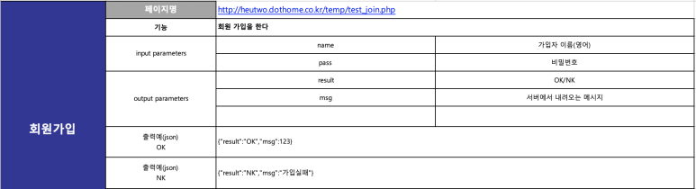

# PHP, Volley

by using volley, Android is able to obtain data that is saved in online PHP files.

## Full code
```JAVA
// Request data from Php File.
private void request() {
    RequestQueue stringRequest = Volley.newRequestQueue(this);
    String url = "http://heutwo.dothome.co.kr/temp/test_join.php";

    StringRequest myReq = new StringRequest(Request.Method.POST, url,
            successListener, errorListener) {
        @Override
        protected Map<String, String> getParams() throws AuthFailureError {
            Map<String, String> params = new HashMap<String, String>();
            params.put("name", "강동하");
            params.put("pass", "1234);

            return params;
        }
    };

    myReq.setRetryPolicy(new DefaultRetryPolicy(3000, 0, 1f));
    stringRequest.add(myReq);
}
```
- **String url**: php Domain link, we will obtain data from there. 데이터를 가져오는 주소
- **protected Map<String,String>**: we will obtain data from there. Getting ready to obtain dat.
- **params.put("name","강동하")**: we will obtain the return key with input name "강동하". the return key is either "OK", or "Not OK".


<br>
<br>

```JAVA
// When obtaining data is successful
Response.Listener<String> successListener = new Response.Listener<String>() {
    @Override
    public void onResponse(String response) {
        // 통신을 성공 할 시
        try {
            JSONObject j = new JSONObject(response);
            if (j.optString("result").equals("OK")) {
                Toast.makeText(MainActivity.this, "회원가입이 완료 되었습니다..", Toast.LENGTH_SHORT).show();
            } else {
                Toast.makeText(MainActivity.this, "회원가입 할 수 없습니다.", Toast.LENGTH_SHORT).show();
            }
        } catch (JSONException e) {
            e.printStackTrace();
        }
    }
};
```

```JAVA
// when obtaining data is unsuccessful.
Response.ErrorListener errorListener = new Response.ErrorListener() {
    @Override
    public void onErrorResponse(VolleyError error) {
        // 통신을 실패할 시
        Toast.makeText(MainActivity.this, "통신이 불가능 합니다.", Toast.LENGTH_SHORT).show();
    }
};
```

## Example response data

- Two inputs, *name* and *pass*. Input two datas using ***params.put***
- if result is available, return *result* and *msg*
- From there, save the data using JSONObject or JSONArray.