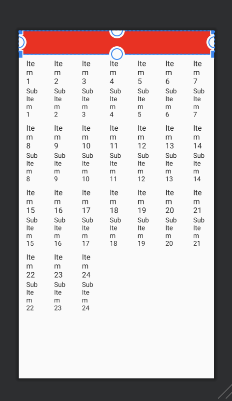

# Grid View
It has similiar property as List View. The difference between Grid View and List View is the number of columns.
It is possible for Grid View to have number of columns, and usually it is used when building a calendar.

---

## XML
```xml
<?xml version="1.0" encoding="utf-8"?>
<RelativeLayout xmlns:android="http://schemas.android.com/apk/res/android"
    xmlns:tools="http://schemas.android.com/tools"
    android:layout_width="match_parent"
    android:layout_height="match_parent"
    tools:context=".MainActivity">

    <LinearLayout
        android:id="@+id/li"
        android:layout_width="match_parent"
        android:background="#ff0000"
        android:layout_height="50dp"
        android:orientation="horizontal">

    </LinearLayout>

    <GridView
        android:id="@+id/gv"
        android:layout_width="match_parent"
        android:layout_height="match_parent"
        android:layout_below="@+id/li"
        android:numColumns="7" />

</RelativeLayout>
```
In the code, the line ```numColumns``` represent the number of columns. 


To see an example press [here](https://github.com/donghakang/Android/tree/master/GridView)
