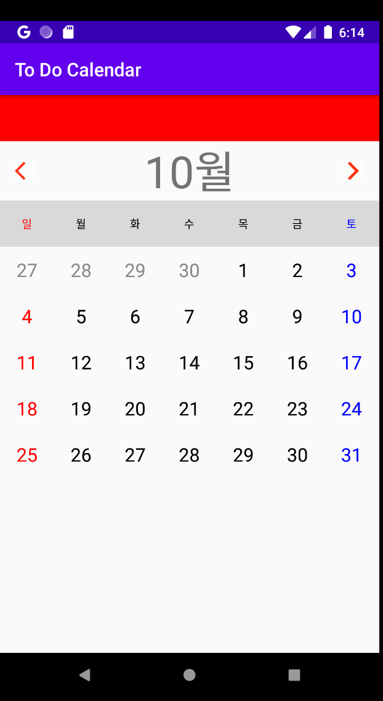
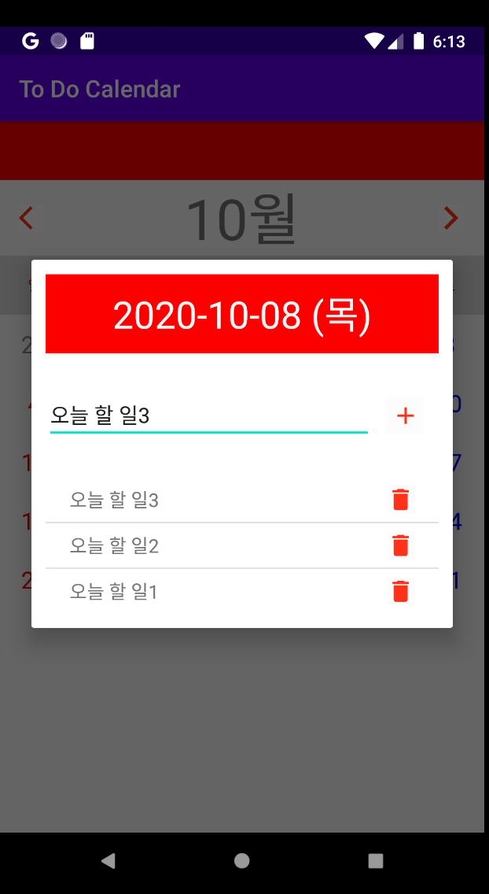

# Calendar + To Do 
Very basic calendar and to do list using Grid View, and SQLite


## Methods Used

---

### Grid View
```xml
...
    <GridView
        android:id="@+id/dd"
        android:layout_width="match_parent"
        android:layout_height="wrap_content"
        android:background="#d9d9d9"
        android:numColumns="7"
        android:layout_below="@+id/mm"/>
...

```

### SQLite
Saving data using SQLite.
```JAVA
/// - SQLite
private void init() {
    db = openOrCreateDatabase("sqlist_test.db", Context.MODE_PRIVATE, null);

    db.execSQL("CREATE TABLE IF NOT EXISTS tasks("
            + "_id INTEGER PRIMARY KEY AUTOINCREMENT, "
            + "year INTEGER, "
            + "month INTEGER, "
            + "date  INTEGER, "
            + "day   TEXT, "
            + "task  TEXT" + ");");
}
```

```JAVA
/// - when date is clicked, get SQL data with current Date
private void setupTaskList(myDate currentDate) {
    ArrayList<String> arr = new ArrayList<>();
    arr.clear();

    String condition = "year = " + currentDate.yy + " AND month = " + currentDate.mm + " AND date = " + currentDate.dd;
    Cursor c = db.rawQuery("SELECT * FROM tasks WHERE (" + condition + ")", null);
    c.moveToFirst();
    while (c.isAfterLast() == false) {
        arr.add(0, c.getString((5)));
        c.moveToNext();
    }
    c.close();

    // custom list view.
    taskAdapter = new TaskAdapter(this, arr, currentDate);
    lvTask.setAdapter(taskAdapter);

    taskAdapter.notifyDataSetChanged();
}
```
**```WHERE```** is the condition that will set up for SQLite. 
This can be substitude with ```SELECT task FROM tasks WHERE (year = _ AND month = _ AND date = _)```

### GetTag, SetTag

 
