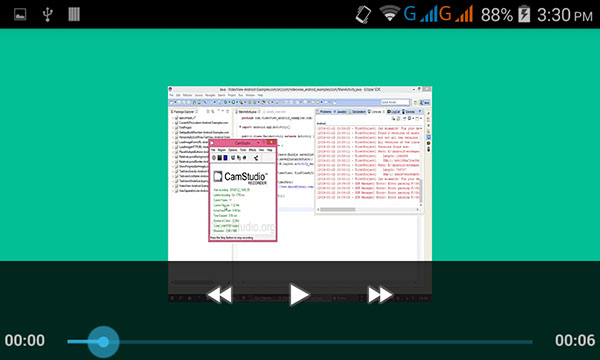
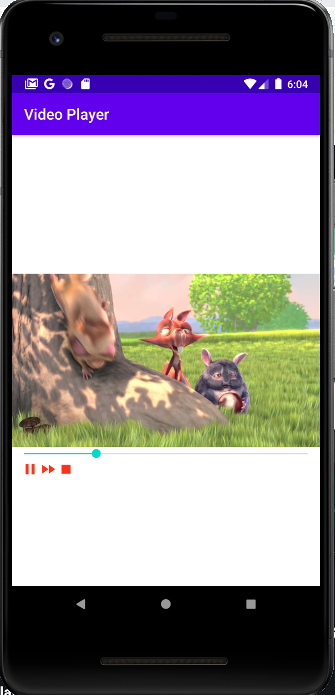

# Video Player

## setup
1. Permission Internet 
```xml
// AndroidManifest.xml
<uses-permission android:name="android.permission.INTERNET"/>
```
2. Setup XML
```xml
<VideoView
    android:id="@+id/vv"
    android:layout_centerVertical="true"
    android:layout_width="wrap_content"
    android:layout_height="wrap_content"/>
```

3. Call in JAVA file
```JAVA
@Override
protected void onCreate(Bundle savedInstanceState) {
    super.onCreate(savedInstanceState);
    setContentView(R.layout.activity_main);

    videoView = findViewById(R.id.vv);

    // Link to video
    Uri uri = Uri.parse("https://commondatastorage.googleapis.com/gtv-videos-bucket/sample/BigBuckBunny.mp4");
    videoView.setVideoURI(uri);
    videoView.requestFocus();

    videoView.setOnPreparedListener(new MediaPlayer.OnPreparedListener() {
        @Override
        public void onPrepared(MediaPlayer mp) {
            // Ready to play
        }
    });


    videoView.setOnCompletionListener(new MediaPlayer.OnCompletionListener() {
        @Override
        public void onCompletion(MediaPlayer mp) {
            // Play is over
        }
    });

}
```


## Features
|Syntax | Description|
|-------| -----------|
|```vv.getDuration();```| total play time (총 재생 시간) in ms|
| ```vv.seekTo(1000);``` | move to 1 sec (현재 재생부분 가져옴) in ms|
|```vv.pause();``` | Pause (일시정지)|
|```vv.resume();```| resume (재개)|
|```vv.stopPlayback();``` | Disable video for good (완전 스탑)|
|```vv.isPlaying()```| Boolean return to find if it is playing (재생 여부)|
|```vv.start();```| start (시작)|


## Media Controller
Default media player, does not use this because of design.
미디어 플레이어 디폴트 뷰 이지만, 디자인 문제로 웬만하면 사용하지 않는다.


```JAVA
MediaController controller = new MediaController(this);
vv.setMediaController(controller);
```


## Seek Bar
Progress bar cannot satisfy the interaction.
프로그래스바로는 할 수 없는 인터렉션을 seekbar 에서는 할수 있다.

```JAVA
// SeekBar seekBar;

seekBar.setOnSeekBarChangeListener(new SeekBar.OnSeekBarChangeListener() {
    @Override
    public void onProgressChanged(SeekBar seekBar, int i, boolean b) {
        // When Progress changes
    }

    @Override
    public void onStartTrackingTouch(SeekBar seekBar) {
        // when tracking touch starts
    }

    @Override
    public void onStopTrackingTouch(SeekBar seekBar) {
        // when tracking touch ends -> change the position of the video.
        videoView.seekTo(seekBar.getProgress());
    }
});
```

## Result

