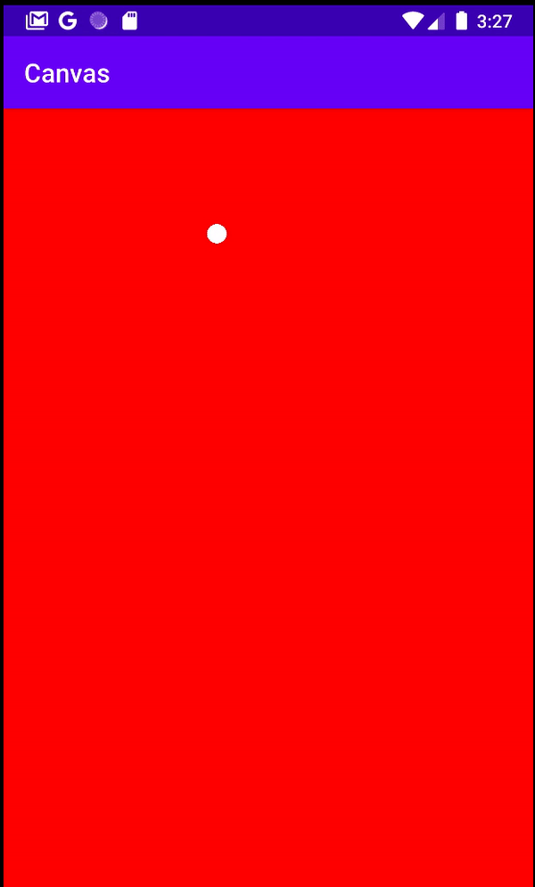

# Canvas
JAVA 에서 했던 Canvas와 비슷한 메소드로, View 를 설정하고, Thread를 이용하여 그림및 움직이는 현상을 표현할 수 있도록 해준다.
Similiar to Java, this canvas will create constant view, and use thread to draw and create moving objects on the view.

### View
View can be created via .xml, this is what we did previously. However, view can be also created in .java file.

```Java
// JAVA file
class MyView extends View {
    public MyView(Context context) {
        // 자바에서 올리면 실행
        super(context);
        Log.d("dddd", "생성자 1");
    }

    public MyView(Context context, @Nullable AttributeSet attrs) {
        // xml에서 올리면 실행
        super(context, attrs);
        Log.d("dddd", "생성자 2");
    }
}
```

```xml
// xml file
<?xml version="1.0" encoding="utf-8"?>
<RelativeLayout xmlns:android="http://schemas.android.com/apk/res/android"
    xmlns:app="http://schemas.android.com/apk/res-auto"
    xmlns:tools="http://schemas.android.com/tools"
    android:layout_width="match_parent"
    android:layout_height="match_parent"
    tools:context=".MainActivity">

    <com.example.canvas.MyView
        android:layout_width="match_parent"
        android:layout_height="match_parent"/>

</RelativeLayout>
```

## Canvas Setup
Canvas를 빨간색 배경화면으로 설정한다.
```JAVA
class MyView extends View {
    
    Paint p;

    public MyView(Context context) { ... }
    public MyView(Context context, @Nullable AttributeSet attrs) { ... }

    @Override
    protected void onDraw(Canvas canvas) {
        super.onDraw(canvas);
        p.setColor(Color.RED);
        canvas.drawRect(0,0,getWidth(),getHeight(),p);
    }
}
```
|type|description|
|-|-|
|```getWidth()```|배경 전체 너비|
|```getHeight()```|배경 전체 높이|
|```canvas.drawRect(0,0,getWidth(),getHeight(),p)```|(0,0)에서 배경 너비의 배경 높이의 사각형을 Paint p 에다가 그린다.|
|```canvas.drawCircle(0,0,radius,p)```|(0,0)에 지름 radius만한 동그라미를 그린다|
|```p.setColor(Color.RED)```|Paint p의 색깔을 빨간색으로 설정|


## Animation
Animation을 만들기위해서는 
1. Draw
2. Thread
이 두가지가 잘 되어있어야한다.

##### Draw
```JAVA
@Override
protected void onDraw(Canvas canvas) {
    super.onDraw(canvas);
    p.setColor(Color.RED);
    canvas.drawRect(0,0,getWidth(),getHeight(),p); // 배경

    /*
    * some motion movement goes here
    */
}
```

##### Thread (invalidate())
```JAVA
public class MyView extends View {
    Paint p;

    public MyView(Context context, @Nullable AttributeSet attrs) {
        super(context, attrs);
        p = new Paint();

        // Thread 시작
        new MyThread().start();
    }

    @Override
    protected void onDraw(Canvas canvas) {
        super.onDraw(canvas);
        p.setColor(Color.RED);
        canvas.drawRect(0,0,getWidth(),getHeight(),p); // 배경

        /*
        * some motion movement goes here
        */
    }


    class MyThread extends Thread {
        @Override
        public void run() {
            super.run();
            // 계속 해서 움직임 (isPlaying등 boolean을 넣어주어도 좋음)
            while(true) {
                // 다시 그리기
                invalidate();
                try {
                    Thread.sleep(1);
                } catch (InterruptedException e) {
                    e.printStackTrace();
                }
            }
        }
    }
}
```


## Example

