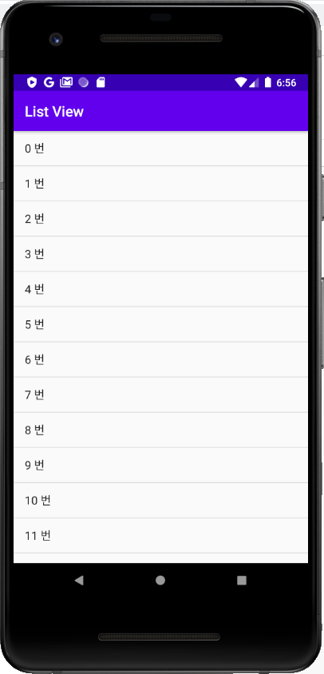

# List View
in swift it is table view.

### Setup
```JAVA
public class MainActivity extends AppCompatActivity implements AdapterView.OnItemClickListener {

    ArrayList<String> arr = new ArrayList<>();
    ListView list;

    @Override
    protected void onCreate(Bundle savedInstanceState) {
        super.onCreate(savedInstanceState);
        setContentView(R.layout.activity_main);

        for (int i = 0; i < 100; i ++) {         // 우선 어레이 리스트로 물건들을 세팅 해놓겠음.
            arr.add(i + " 번");
        }


        ArrayAdapter adapter = new ArrayAdapter(this, android.R.layout.simple_list_item_1, arr);
        list.setAdapter(adapter);        // ListView list = findViewById(R.id.list);
        list.setOnItemClickListener(this);
    }

    @Override
    public void onItemClick(AdapterView<?> adapterView, View view, int position, long l) {
        Log.d("DEBUGGING", "i: " + position + "번");
    }
}
```
- ```setAdapter```: set up the adapter as list view.
- ```setOnItemClickListener```: when *position* item is clicked.


```XML
<ListView
        android:id="@+id/list"
        android:layout_width="match_parent"
        android:layout_height="match_parent" />
```


### Example
