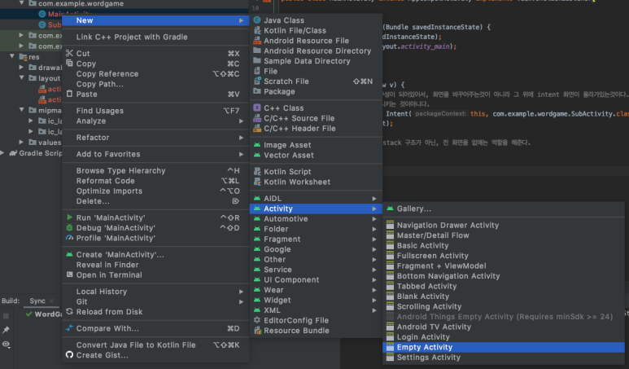

# MainActivity -> SubActivity

## Add SubActivity


3 objects are made from this.
1. java/com.example.project/SubActivity.java
2. res/layou/activity_sub.xml
3. ```<activity android:name=".SubActivity></activity>``` in AndroidManifest.xml

## Move to SubActivity
```JAVA
Intent intent = new Intent(this, com.example.project.SubActivity.class);
startActivity(intent);
```
- this will add just like *stack*. Therefore, by pressing back button will go to previous activity.
- If you don't want to add activity as *stack*, add ```finish()``` in there.
  
```JAVA
@Override
public void onClick(View v) {
    // 이 곳은 Stack처럼 구성이 되어있어서, 화면을 바꾸어주는것이 아니라 그 위에 intent 화면이 올라가있는것이다.
    // 즉 이전 화면을 종료 시키는 것이아니다.
    Intent intent = new Intent(this, com.example.project.SubActivity.class);
    startActivity(intent);
    // finish 를 사용하면 stack 구조가 아닌, 전 화면을 없애는 역할을 해준다.
    finish()
}
```

## Pass Data to SubActivity
```JAVA
intent.putExtra("name", "Chris);
intent.putExtra("age",  25);
intent.putExtra("isMale", true);
```

## Obtain data from SubAcitivy
```JAVA
String name = getIntent().getStringExtra("name");
int b = getIntent().getIntExtra("age");
boolean c = getIntent().getBooleanExtra("isMale");
```